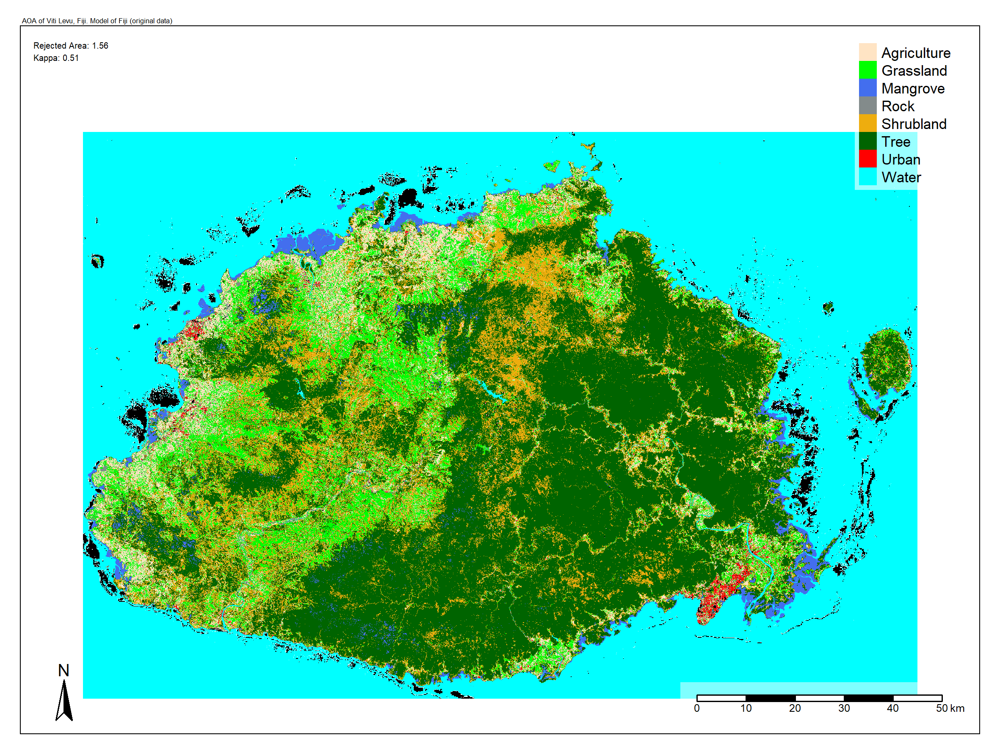

# Local Data Point-based analysis of the accuracy of spatial prediction models 
This work aims to evaluate the accuracy of spatial prediction models using the "Local Data Point Density" (Schumacher et al., 2024 (a)) and therefore proving the functionality of the "LPD" and it's advantages as a extension of the "Disimilarity Index" (Meyer & Pebesma, 2021). The purpose of this GitHub Page is to grant further insides into the methodology of the study. It is supposed to give a quick overview of the project, summarising the results. The uploaded code is slightly modified and for the sake of reproducibility every used function is seeded. In order to improve readability of the code, some parts will be removed (e.g. where the same command is repeated several times to get the same result for each case study area). For further questions feel free to contact me: k_galb01@uni-muenster.de

## Motivation
- Machine learning is now a mainstream technology, used beyond just scientific applications.
- In geoscience, it helps predict spatial processes and calculate land use classifications.
- The "Area of Applicability" (AOA) determines where models can be applied reliably, by setting a threshold for the "Dissimilarity Index" (DI) (Meyer & Pebesma, 2021).
- The DI calculates the Euclidian distance between a new data point and a training data point, assuming that for more similarities between a model is to the new data, the model is able to create more reliable predictions (Meyer & Pebesma, 2021).
- The "Local Data Point Density" (LPD) improves AOA by considering both distance and data density, enhancing model accuracy in clustered areas (Schumacher et al., 2024 (a)).
- This study evaluates LPD's effectiveness in improving spatial prediction models.

Figure 1: Diagram illustrating how the LPD works (Source: Schumacher et al., 2024 (b). Development of a local data point density approach to assess the area of applicability for spatial prediction models.)

## Case Study
- The Fiji Islands, Rhineland-Palatinate (RLP), and Germany were chosen as case study areas to evaluate the LPD approach across diverse landscapes and test the transferability of the model.
- Fiji was selected for its contrasting geographical and climatic characteristics and the availability of high-quality training data, created through ground truthing, with diverse land cover classes (Duncan, 2023). These data include eight classes, with a balanced distribution for improved classification accuracy.
- RLP was chosen for its geographical contrast to Fiji, its distinct environmental characteristics, and its manageable size, which is comparable to Fiji. Training data for RLP were created using an R script that extracted random points from the official Digital Landscape Model (DLM) (Landesamt für Vermessung und Geobasisinformation Rheinland-Pfalz, 2005 - 2010).
- Germany was included as an intermediary area for testing the transferability of the RLP model. While it shares similar climatic and geographical characteristics with RLP, it also exhibits distinct land use patterns that allow for incremental model validation.
- The primary goal is to use these training datasets to create land use and land cover (LULC) models in R, leveraging LPD to improve accuracy and reliability. 
- To validate the results, training data for both RLP and Fiji are modified to exclude the dominant land cover class (“Tree” for Fiji and “Vegetation” for RLP). These modified datasets are used to assess the models' adaptability to missing data.
- By comparing the performance of LPD-enhanced spatial prediction models in tropical and temperate environments, the study aims to demonstrate the method's effectiveness in improving prediction accuracy and identifying uncertainties across diverse landscapes.

## Results
- To evaluate the spatial prediction models, metrics from the `caret` package in R, such as cross validation accuracy and kappa, were used as a baseline. These metrics were supplemented by the `CAST` package to assess the models' applicability and reliability on unseen data.
- The results were analyzed across different applications:
- **Model of RLP:**
    1. **Rhineland-Palatinate (RLP):**
       - The RLP model achieved high accuracy (0.85) and kappa (0.78) despite outdated training data.
       - AOA showed 0.68% rejection, with uncertainties primarily in urban areas like Koblenz, Trier, and Mannheim.
       - DI confirmed high similarity between training and raster data, with urban and water bodies standing out as high-uncertainty regions.
       - LPD highlighted areas of reliability, with forests and vegetation showing the strongest performance.
    2. **Germany:**
       - When applied to Germany, accuracy slightly declined. The AOA rejected 1.41% of data, primarily water bodies and islands.
       - DI values indicated greater dissimilarity in northern and eastern Germany, while southern regions showed better applicability.
       - LPD results confirmed RLP as the region with the highest similarity to the training data, with forests performing well.
    3. **Fiji:**
       - Applying the RLP model to Fiji led to 23.47% rejection by the AOA, with large water bodies, coral reefs, and mangroves classified as unreliable.
       - DI and LPD showed that the model was unsuitable for tropical regions, with high rejection rates and low reliability, particularly for vegetation classes.

- **Model of Fiji:**
  - Accuracy (0.58) and kappa (0.50) were lower than RLP's model. Stratified accuracy rose to 0.69 but did not meet the target of 0.75 for each class.
  - AOA rejected 1.56% of data, with coral reefs along the coast flagged as unreliable.
  - DI and LPD confirmed strong performance for vegetation but highlighted challenges with urban areas and mangroves.
  - When applied to RLP, the Fiji model performed better than expected, showing strong similarities in forested areas but misclassifying wine-growing regions.

- **Modified Training Data:**
  - Removing dominant classes (`Vegetation` for RLP, `Tree` for Fiji) improved accuracy and kappa slightly but reduced the reliability of predictions (as indicated by LPD).
  - Modifications revealed limitations in the AOA, which was influenced by outliers in the DI, but LPD consistently highlighted regions where data were insufficient.
  - Modified datasets failed to improve applicability across regions and emphasized the importance of balanced class representation.

## Plots and Figures

|  |  |
|:-------------------------------------------------------------------------:|:-------------------------------------------------------------------------------------:|
| *Figure 2: Prediction plot of RLP, calculated based on the training data of RLP. Includes the AOA (marked in black).* | *Figure 3: Prediction plot of Viti Levu, Fiji, calculated based on the training data of Fiji. Includes the AOA (marked in black).* |

 

|  |  |
|:---------------------------------------------------------------------------:|:------------------------------------------------------------------------------:|
| *Figure 4: LPD plot of Viti Levu, Fiji, calculated based on the training data of Fiji.* | *Figure 5: LPD plot of Viti Levu, Fiji, calculated based on the training data of RLP.* |

## Conclusions:
- The RLP model outperformed expectations despite outdated training data but faced challenges with urban areas and water bodies.
- The Fiji model, trained on ground-truthed data, showed greater adaptability but struggled with class-specific misclassifications, particularly for agricultural areas in RLP.
- Metrics from `CAST` provided critical insights into model applicability, with LPD being the most robust in identifying areas of low reliability.
- Cross validation accuracy measures correct predictions against held-back training data, while kappa accounts for correct predictions occurring by chance. These metrics, though informative, have limitations and were compared with the extended metrics of `CAST` (AOA, DI, and LPD).
- Modifications to training data confirmed the influence of dominant classes on model performance and highlighted the importance of comprehensive training datasets for cross-regional applications.

## Bibliography
- Landesamt für Vermessung und Geobasisinformationen Rheinland-Pfalz (2005 – 2010). Digitales Basislandschaftsmodell (Basis-DLM). https://lvermgeo.rlp.de/produkte/geotopografie/digitale-landschaftsmodelle-dlm/digitales-basislandschaftsmodell-basis-dlm.
- Meyer, H., & Pebesma, E. (2021). Predicting into unknown space? Estimating the area of applicability of spatial prediction models. Methods in Ecology and Evolution, 12(9), 1620 – 1633. https://doi.org/10.1111/2041-210X.13650.
- Schumacher, F., et al. (2024 (a)). The CAST Package for Training Assessment of Spatial Prediction Models in R. https://doi.org/10.48550/arXiv.2404.06978.
- Schumacher, F., et al. (2024 (b)). Assessing the area of applicability of spatial prediction models through a local data point density approach. https://www.egu.eu/media/awards/posters/2024/08/30/cc57f0ad-37c0-4065-8259-e0f56b49f40b.pdf.
